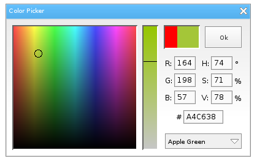

# Overview
A color picker for [Love Frames](https://github.com/NikolaiResokav/LoveFrames) - GUI library for [LÖVE](http://www.love2d.org).

## Installation
Option 1. Place ``colorPicker.lua`` inside your LoveFrames objects directory.

Option 2. Place ``colorPicker.lua`` anywhere and require it after LoveFrames.

## Usage
Call ``colorPicker()`` within your code. It takes 6 arguments:

1. (optional) Initial color, in the form of a {r, g, b} table. Default: ``{255, 0, 0}``.
2. (optional) A callback function. A {r, g, b} table is passed to it. Default: ``function(c) print(unpack(c)) end``.
3. (optional) Make Top, boolean. Default: ``true``.
4. (optional) Modal, boolean. Default: ``true``.
5. (optional) Screen Locked, boolean. Default: ``true``.
6. (optional) The loveframes module itself. Default: ``loveframes``.

## Example usage

	function doStuff(color)
		-- stuff
	end

	local button = loveframes.Create("button", frame)
	button:SetWidth(200)
	button:SetText("Color Picker")
	button.OnClick = function(object, x, y)
		colorPicker({255, 0, 0}, doStuff)
	end

## Screenshot

## Issues
Pixel manipulation is used to update the colors of the sliders, and it's slow. I might change to shaders in the future, but in the meantime you can require [this](https://github.com/slime73/love-snippets/blob/master/ImageData-FFI/imagedata-ffi.lua) in your project to get a considerable speed boost.
