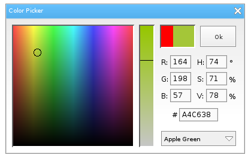

Overview
========
A color picker for `Love Frames <https://github.com/NikolaiResokav/LoveFrames>`_ - GUI library for `LÖVE <http://www.love2d.org>`_.

Compatible with LÖVE 0.8.0 -> 0.9.1.

Installation
------------
Place the ``LoveFrames-ColorPicker`` folder in your working directory, or in a sub-folder, and require it.

.. code-block:: lua

	require("LoveFrames-ColorPicker")

Usage of colorPicker
--------------------
Call ``colorPicker()`` within your code. It takes a table of parameters:

* @param ``color`` (optional) rgb table. Default: ``{255, 0, 0}``.
* @param ``callback`` (optional) function. Default: ``function(c) print(unpack(c)) end``.
* @param ``makeTop`` (optional) boolean. Default: ``true``.
* @param ``modal`` (optional) boolean. Default: ``true``.
* @param ``screenLocked`` (optional) boolean. Default: ``true``.
* @param ``loveframes`` (optional) module. Default: ``loveframes``.
* @param ``shaders`` (optional) boolean. Default: ``false``. *``Only work with LÖVE past version 0.9.0.``*
* @returns a loveframes frame instance.

Performance difference using shaders:

+-------------+---------------+--------------+
| ``Avg FPS`` | shaders false | shaders true |
+-------------+---------------+--------------+
| idle        |           454 |          455 |
+-------------+---------------+--------------+
| used        |           457 |          457 |
+-------------+---------------+--------------+

Reference System - Intel Core i7 4770K @ 3.50 GHz | AMD Radeon HD 7790 | Windows 8.1

Example
-------
.. code-block:: lua

	function doStuff(color)
		-- stuff
	end

	colorPicker({
		color = {164, 198, 57},
		callback = doStuff,
		shaders = true
	})

Usage of colorButton
--------------------
Call ``colorButton()`` within your code. It takes a table of parameters:

* @param ``parent`` (optional) loveframes object. Default: ``nil``.
* @param ``width`` (optional) integer. Default: ``25``.
* @param ``height`` (optional) integer. Default: ``25``.
* @param ``padding`` (optional) integer. Default: ``3``.
* @returns a modified instance of loveframes button.

Any parameters of ``colorPicker()`` are also accepted.

The returned object has all methods of a loveframes button, plus two more: ``GetColor()``, and ``SetColor({r, g, b})``.

Example
-------
.. code-block:: lua

	local button = colorButton({
			color = {107, 218, 20},
			padding = 4
		})
	button:SetPos(100, 100)
	button:GetColor() -- returns {107, 218, 20}

Usage of gradientEditor
-----------------------
WORK IN PROGRESS

Call ``gradientEditor()`` within your code. It takes a table of parameters:

* @param same as ``colorPicker()``.
* @returns a modified instance of loveframes button.

Example
-------
.. code-block:: lua
	local gradient

	function doStuff(gradient)
		gradient = gradient.createImage(600, 300, "vertical")
	end

	local button = loveframes.Create("button")
	button:SetSize(100, 40)
	button:SetPos(100, 100)
	button:SetText("Gradient Editor")
	button.OnClick = function()
		gradientEditor({
			callback = doStuff
		})
	end

.. image:: gradientEditor.gif
  :alt: Screenshot

Issues
------
~